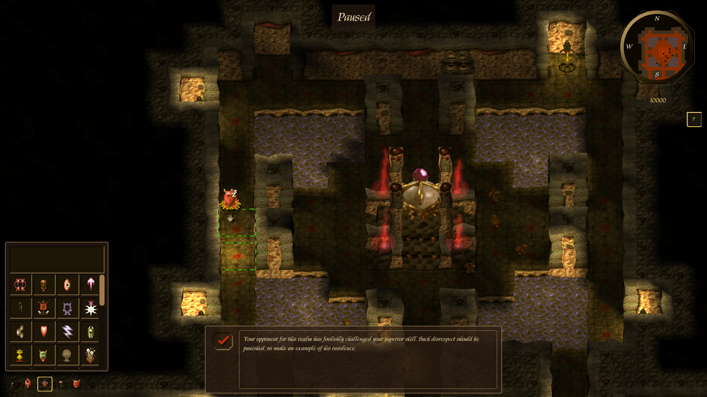

## Intro

**dAImon Keeper** is a free, open-source reimplementation of Bullfrog's classic
dungeon-management game, [Dungeon Keeper](https://en.wikipedia.org/wiki/Dungeon_Keeper).
It is derived from **KeeperFX** (Dungeon Keeper Fan eXpansion), and plays the
campaigns and map packs made for it.

KeeperFX began as a decompilation of the original game executables; over the
years its entire codebase was rewritten in C/C++. dAImon Keeper continues from
that rewritten codebase and focuses on **structural modernization**: `src/` has been refactored from one flat 266-file directory
into a set of internal libraries with a strict, enforced dependency graph, the
platform layer has moved to SDL3, the build now produces first-class
**native Linux** binaries alongside the Windows build (all driven by CMake), and
the game now ships an **in-game level, content and campaign editor** plus an
optional **GPU (Vulkan) renderer** with dynamic lighting and soft shadows.

dAImon Keeper is a standalone game, but it needs a copy of the original Dungeon
Keeper data files as proof of ownership -- it contains none of them. These can be
copied from an old CD or from a digital edition (EA, GOG, Steam).

### Relationship to KeeperFX

dAImon Keeper is **not affiliated with the KeeperFX team** and is maintained
separately. Please direct issues, questions and pull requests **about dAImon
Keeper** to [this repository](https://github.com/edorien/daimonkeeper) --
not to KeeperFX's Discord, forums or issue tracker.

For KeeperFX itself, its community and its releases, see
[keeperfx.net](https://keeperfx.net). All credit for the original reimplementation
work belongs to the KeeperFX project and the Keeper Klan community (see
[Acknowledgements](#acknowledgements) and [NOTICE](NOTICE)).

### Compatibility with KeeperFX

- **Campaigns and map packs**: the version label says which KeeperFX release's
  content this version plays -- `dAImon Keeper 1.0.0 — KFX 1.4` plays content
  made for **KeeperFX 1.4**. Content that needs a newer KeeperFX is marked
  `[!]` in the level and campaign lists (with the reason on hover), and a level
  that uses something this version doesn't support says so before play, instead
  of crashing. Mods still override settings with their own `keeperfx.cfg`.
- **Saves, replays and multiplayer are not shared**: dAImon Keeper and KeeperFX
  refuse each other's saves and replays, don't see each other's LAN games, and
  dAImon Keeper doesn't use KeeperFX's matchmaking server (online matchmaking is
  off by default).
- **Install it in its own folder**: dAImon Keeper has its own settings
  (`daimonkeeper.cfg`, seeded once from an existing `keeperfx.cfg`) and log
  (`daimonkeeper.log`), but uses the same `fxdata/`, `save/` and `replays/`
  folders as KeeperFX, whose contents differ between the two games. Keep each
  game in its own folder; to share files between them (the original game data,
  campaigns, maps), use symlinks.
- **Map editor**: saving with Format "Force KeeperFX" writes a map that loads in
  KeeperFX 1.4 -- it refuses maps that use anything only dAImon Keeper has.

## Features

Everything from KeeperFX, including:

- Windows 7/10/11 support
- Higher screen resolutions
- Increased FPS, with graphics decoupled from game logic
- Improved and modernized controls
- Many bugfixes over the original game
- Map, campaign and modding customizability
- Lua scripting for campaigns and maps
- Improved computer-player AI
- Additional campaigns, maps, creatures and other content

dAImon Keeper additionally provides:

- **Native Linux builds** — a real ELF binary, not a Wine wrapper, portable
  enough to copy to a machine that never ran the build
- **CMake** as the single build definition for every target (native Linux,
  Windows via MSVC/clang-cl, and Windows via mingw-w64 cross-compile), with
  third-party dependencies fetched and built automatically
- A **layered architecture**: `src/` is split into internal libraries
  (`kfx_platform`, `kfx_config`, `kfx_pathfinding`, `kfx_sim`, `kfx_render`,
  `kfx_net`, `kfx_game`, `kfx_frontend`, `kfx_script`, `kfx_apploop`,
  `kfx_editor`) with a one-directional, acyclic dependency graph enforced in CI
- The old ~176-field `struct Game` god-object broken up into per-library state
- **64-bit clean**: `long`/pointer-width assumptions removed (64-bit integers and
  doubles throughout, pointer-free state blobs), with a lint ratchet to keep it so
- **32-bit software renderer** (no more single 8-bit palette per frame) and an
  optional **GPU renderer** (SDL_GPU/Vulkan, selectable under Options → Graphics)
  with per-pixel coloured dynamic lights, shadow rays and soft shadows
- **Dear ImGui front end and HUD**: every menu screen is ImGui, plus a reworked
  in-game sidebar/HUD (classic look still selectable via `GUI_ICON_PACK`)
- **Map Editor** (main menu → Tools): terrain, things, rooms, doors, traps, undo,
  map resize, script and **Lua** editing with validation, level settings,
  classic-format and KeeperFX-format save, and one-click playtest
- **Content editors**: raw config editor, rules, creature, trap/door,
  spell/ability, room, text/string and **campaign** editors (new-campaign wizard,
  levels, land views, speech), with schema validation and a lossless `.cfg` model
- **Skirmish setup tab**: per-level rules, availability, win/lose conditions and
  AI slots, layered over the level's own script
- Frontend/Options-screen and campaign-progress reworks
- Catch2 unit tests per library, alongside the in-game functional tests
- **Compatibility checks** for KeeperFX content: `[!]` markers in the level
  and campaign lists and a warning before play (see
  [Compatibility with KeeperFX](#compatibility-with-keeperfx))
- **External/AI player seats** over an in-game TCP API, with an MCP bridge
  (`scripts/llm_bridge/`) so an AI assistant can play a keeper

Still in progress or planned: finishing the GPU renderer (depth-buffer rollout,
more effects), bringing the modernised HUD further into line with the classic
look, and later AI and pathfinding optimisation plus features shown in early
*Dungeon Keeper* previews that never shipped (e.g. hero mode, an AI Keeper with
cross-session memory).

## Screenshots

### Single-screen menu flows

The old multi-screen campaign / scenario routes are now one screen each: pick a
campaign or map pack on the left, preview the land or level on the right, enter.

| Land selection (campaigns)                                                     | Scenarios (map packs)                                                     |
| ------------------------------------------------------------------------------ | ------------------------------------------------------------------------- |
| [](docs/assets/landview.png) | [](docs/assets/scenario.png) |

Reworked sidebar and HUD over the 32-bit renderer (screenshots
predate the editors and the GPU lighting work).

[](docs/assets/ingame.png)

## How to play

You need the original Dungeon Keeper data files, from an old CD or from the
digital edition available on
[EA](https://www.ea.com/games/dungeon-keeper/dungeon-keeper),
[GOG](https://www.gog.com/game/dungeon_keeper) or
[Steam](https://store.steampowered.com/app/1996630/Dungeon_Keeper_Gold/).

Unpack the dAImon Keeper package into a folder with the original game's files
(an existing KeeperFX folder works too), and run `daimonkeeper` (`daimonkeeper.exe`
on Windows). Which files the game needs from the original release is documented
in [docs/files_required_from_original_dk.txt](docs/files_required_from_original_dk.txt);
see also [docs/daimonkeeper_readme.txt](docs/daimonkeeper_readme.txt). KeeperFX's
[GitHub Wiki](https://github.com/dkfans/keeperfx/wiki) has general installation
guidance and an FAQ that largely applies here too.

## Development

The build is CMake-based and fetches / builds its own third-party dependencies
(SDL3, OpenAL, ffmpeg, LuaJIT, …), so a machine with just a C/C++ toolchain,
`cmake`, `ninja` and `pkg-config` can build end-to-end. It produces one
binary, `daimonkeeper` (the CMake target is still called `keeperfx`). How much it
logs is the **Logging** option (`LOG_LEVEL` in `daimonkeeper.cfg`: `OFF`,
`NORMAL`, `DEBUG` or `DEBUGMAX`), which applies at once.

### Linux (native)

Needs `gcc`/`g++`, `cmake`, `ninja`, `pkg-config`. Everything else is fetched.

```bash
./build-cmake-linux.sh                        # build out/linux/daimonkeeper
SKIP_WINDOWS=1 ./build-package.sh             # full package -> dist/linux/
```

### Windows

**Cross-compiled from Linux** (this is what CI runs) — needs a MinGW-w64 i686
toolchain (`g++-mingw-w64-i686`), `cmake`, `ninja`:

```bash
KFX_OS=windows ./build-cmake-linux.sh                 # build out/windows/daimonkeeper.exe
USE_DOCKER=1 KFX_OS=windows ./build-cmake-linux.sh    # do it in an Ubuntu 24.04 container
```

**Natively on Windows** — from an [MSYS2](https://www.msys2.org) *MINGW32*
environment with `mingw-w64-i686-{gcc,cmake,ninja}`, `make`, `git`, `p7zip`,
`curl`, `unzip` installed:

```bat
build-package-windows.bat        REM MinGW build + full package -> pkg\*.7z and dist\windows\
```

Run it from an ordinary Command Prompt; it boots MSYS2 and calls
`build-package-windows.sh` (which also works if run directly from a MINGW32
shell). It does not do the Linux build or the coverage pass.

- Build details, layout and conventions: [CLAUDE.md](CLAUDE.md)
- Architecture (authoritative, kept current): [docs/Architecture/architecture.md](docs/Architecture/architecture.md)
- Layering check (CI-blocking): `python3 scripts/check_layering.py --strict`

Tests:

- In-game functional tests: `src/ftests/` (run with `-ftests`) — see
  [src/ftests/README.md](src/ftests/README.md)
- Standalone CUnit programs: `tests/`
- Per-library Catch2 unit tests: `src/kfx_*/tests/` (`KFX_BUILD_TESTS=ON`, native
  Linux)
- KeeperFX content parity: `python3 scripts/kfx_parity.py` (what KeeperFX has that
  this tree lacks, and the reverse)

## Components

These are resources of the KeeperFX project. dAImon Keeper merges from its game
engine and reuses its asset repositories; the dAImon Keeper artwork (icon,
start-up screens, banner) is generated from `res/branding/`.

| Component                                                       | Language  | Info                                                 |
| --------------------------------------------------------------- | --------- | ---------------------------------------------------- |
| [KeeperFX](https://github.com/dkfans/keeperfx)                  | C, C++    | Upstream game engine.                                |
| [FXGraphics](https://github.com/dkfans/FXGraphics)              | -         | Sources of KeeperFX graphics files.                  |
| [FXSounds](https://github.com/dkfans/FXsounds)                  | -         | Sources of KeeperFX audio files.                     |
| [Masterserver](https://github.com/dkfans/keeperfx-masterserver) | PHP (CLI) | Multiplayer masterserver for finding public lobbies. |
| [Website](https://github.com/dkfans/keeperfx-website)           | PHP       | https://keeperfx.net                                 |

## Tools

Bundled under [tools/](tools/), built by the asset pipeline's Makefile rules
(`build/make/tool_*.mk`):

| Tool        | Usage                                                                              |
| ----------- | ---------------------------------------------------------------------------------- |
| po2ngdat    | Converts `.po` files (language) to `.dat`.                                         |
| pngpal2raw  | Creates a `.raw` image file usable by the game from a `.png` and a `.pal` palette. |
| fxfontmaker | Builds the in-game bitmap fonts.                                                   |

Scripts under [scripts/](scripts/) include the layering check, the KeeperFX parity
check (`kfx_parity.py`), and the generators for `THIRD_PARTY_NOTICES.txt` and the
editor's KeeperFX-compatibility list.

## Contributing

Contributions to dAImon Keeper are welcome.

- Report bugs by opening [issues](https://github.com/edorien/daimonkeeper/issues).
- Contribute code by opening [pull requests](https://github.com/edorien/daimonkeeper/pulls).
- Run `python3 scripts/check_layering.py --strict` before adding any cross-library `#include`.

## Acknowledgements

- **Bullfrog Productions** for the original *Dungeon Keeper*.
- **The KeeperFX project and the Keeper Klan community** for many years of work
  reverse-engineering, rewriting and expanding the game. dAImon Keeper would not
  exist without it -- visit [keeperfx.net](https://keeperfx.net).
- The authors of the bundled campaigns and maps, and of the libraries listed in
  [THIRD_PARTY_NOTICES.txt](THIRD_PARTY_NOTICES.txt).

## License

The program is licensed under the [GNU General Public License](LICENSE), version 2
or (at your option) any later version. The graphics are GPLv3 (`gfx/LICENSE`),
the fonts SIL OFL. [NOTICE](NOTICE) says where dAImon Keeper comes from and what
each licence covers; [THIRD_PARTY_NOTICES.txt](THIRD_PARTY_NOTICES.txt) holds the
bundled libraries' licences.
